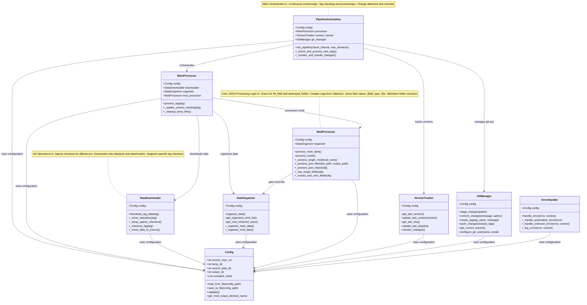

```mermaid
classDiagram
    class PipelineAutomation {
        +Config config
        +MainProcessor processor
        +VersionTracker version_tracker
        +GitManager git_manager
        +run_pipeline(check_interval, max_iterations)
        +_check_and_process_new_tags()
        +_monitor_and_handle_changes()
    }
    
    class MainProcessor {
        +Config config
        +DataDownloader downloader
        +DataOrganizer organizer
        +ModProcessor mod_processor
        +process_tag(tag)
        +_update_version_tracking(tag)
        +_cleanup_temp_files()
    }
    
    class DataDownloader {
        +Config config
        +download_tag_data(tag)
        +_clone_repository(tag)
        +_setup_sparse_checkout()
        +_checkout_tag(tag)
        +_move_data_to_source()
    }
    
    class DataOrganizer {
        +Config config
        +organize_data()
        +get_organized_mod_list()
        +get_mod_info(mod_name)
        +_organize_main_data()
        +_organize_mod_data()
    }
    
    class ModProcessor {
        +Config config
        +DataOrganizer organizer
        +process_main_data()
        +process_mods()
        +_process_single_mod(mod_name)
        +_process_json_file(input_path, output_path)
        +_process_json_object(obj)
        +_has_target_fields(obj)
        +_extract_and_zero_fields(obj)
    }
    
    class VersionTracker {
        +Config config
        +get_last_version()
        +update_last_version(version)
        +get_last_sha()
        +update_last_sha(sha)
        +monitor_changes()
    }
    
    class GitManager {
        +Config config
        +stage_changes(paths)
        +commit_changes(message, author)
        +create_tag(tag_name, message)
        +push_changes(include_tags)
        +get_current_branch()
        +configure_git_user(name, email)
    }
    
    class Config {
        +str source_repo_url
        +str temp_dir
        +str source_data_dir
        +str output_dir
        +List excluded_mods
        +load_from_file(config_path)
        +save_to_file(config_path)
        +validate()
        +get_mod_output_dir(mod_name)
    }
    
    class ErrorHandler {
        +Config config
        +handle_error(error, context)
        +_handle_automation_error(error)
        +_handle_unknown_error(error, context)
        +_log_error(error, context)
    }
    
    PipelineAutomation --> MainProcessor : orchestrates
    PipelineAutomation --> VersionTracker : tracks versions
    PipelineAutomation --> GitManager : manages git ops
    PipelineAutomation --> Config : uses configuration
    
    MainProcessor --> DataDownloader : downloads data
    MainProcessor --> DataOrganizer : organizes data
    MainProcessor --> ModProcessor : processes mods
    MainProcessor --> Config : uses configuration
    
    DataDownloader --> Config : uses configuration
    DataOrganizer --> Config : uses configuration
    ModProcessor --> Config : uses configuration
    ModProcessor --> DataOrganizer : gets mod info
    
    VersionTracker --> Config : uses configuration
    GitManager --> Config : uses configuration
    
    ErrorHandler --> Config : uses configuration
    
    note for ModProcessor "Core JSON Processing Logic:\n- Scans for hit_field and destroyed_field\n- Creates copy-from objects\n- Zeros field values: [field_type, 0]\n- Maintains folder structure"
    
    note for DataDownloader "Git Operations:\n- Sparse checkout for efficiency\n- Downloads only data/json and data/mods\n- Supports specific tag checkout"
    
    note for PipelineAutomation "Main Orchestrator:\n- Continuous monitoring\n- Tag checking and processing\n- Change detection and commits"
```