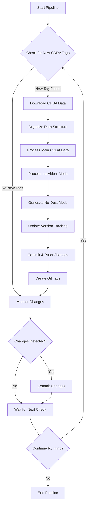

```mermaid
flowchart TD
    A[Start Pipeline] --> B{Check for New CDDA Tags}
    B -->|New Tag Found| C[Download CDDA Data]
    B -->|No New Tags| M[Monitor Changes]
    
    C --> D[Organize Data Structure]
    D --> E[Process Main CDDA Data]
    E --> F[Process Individual Mods]
    F --> G[Generate No-Dust Mods]
    G --> H[Update Version Tracking]
    H --> I[Commit & Push Changes]
    I --> J[Create Git Tags]
    J --> M
    
    M --> N{Changes Detected?}
    N -->|Yes| O[Commit Changes]
    N -->|No| P[Wait for Next Check]
    O --> P
    P --> Q{Continue Running?}
    Q -->|Yes| B
    Q -->|No| R[End Pipeline]
```