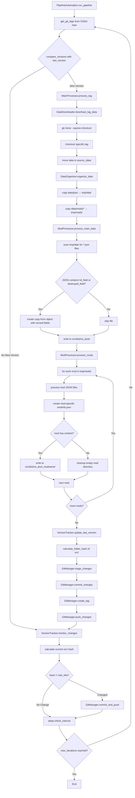

```mermaid
flowchart TD
    A[PipelineAutomation.run_pipeline] --> B[get_git_tags from CDDA repo]
    B --> C{compare_versions with last_version}
    C -->|New Version| D[MainProcessor.process_tag]
    C -->|No New Version| Z[VersionTracker.monitor_changes]
    
    D --> E[DataDownloader.download_tag_data]
    E --> E1[git clone --sparse-checkout]
    E1 --> E2[checkout specific tag]
    E2 --> E3[move data to source_data/]
    E3 --> F[DataOrganizer.organize_data]
    
    F --> F1[copy data/json → tmp/dda/]
    F1 --> F2[copy data/mods/* → tmp/mods/]
    F2 --> G[ModProcessor.process_main_data]
    
    G --> G1[scan tmp/dda/ for *.json files]
    G1 --> G2{JSON contains hit_field or destroyed_field?}
    G2 -->|Yes| G3[create copy-from object with zeroed fields]
    G2 -->|No| G4[skip file]
    G3 --> G5[write to src/dist/no_dust/]
    G4 --> G5
    G5 --> H[ModProcessor.process_mods]
    
    H --> H1[for each mod in tmp/mods/]
    H1 --> H2[process mod JSON files]
    H2 --> H3[create mod-specific modinfo.json]
    H3 --> H4{mod has content?}
    H4 -->|Yes| H5[write to src/dist/no_dust_modname/]
    H4 -->|No| H6[cleanup empty mod directory]
    H5 --> H7[next mod]
    H6 --> H7
    H7 --> I{more mods?}
    I -->|Yes| H1
    I -->|No| J[VersionTracker.update_last_version]
    
    J --> K[calculate_folder_hash of src/]
    K --> L[GitManager.stage_changes]
    L --> M[GitManager.commit_changes]
    M --> N[GitManager.create_tag]
    N --> O[GitManager.push_changes]
    O --> Z
    
    Z --> Z1[calculate current src/ hash]
    Z1 --> Z2{hash != last_sha?}
    Z2 -->|Changed| Z3[GitManager.commit_and_push]
    Z2 -->|No Change| Z4[sleep check_interval]
    Z3 --> Z4
    Z4 --> P{max_iterations reached?}
    P -->|No| B
    P -->|Yes| Q[End]
```